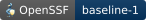

<div align="center">
  
</div>

<p align="center">
  <a href="https://github.com/solongate/agent-security/actions/workflows/ci.yml"></a>
  <a href="https://www.bestpractices.dev/projects/15333"></a>
  <a href="https://github.com/solongate/agent-security/releases"></a>
  <a href="LICENSE"></a>
  <a href="https://www.bestpractices.dev/projects/15333"></a>
  <a href="https://go.dev"></a>
  <a href="https://nodejs.org"></a>
</p>

<p align="center">
  <a href="CONTRIBUTING.md"><b>Contributing</b></a> ·
  <a href="SECURITY.md"><b>Security</b></a>
</p>

---

**SolonGate Agent Security** is SolonGate's open source, local first security
gateway for AI coding agents. It checks tool calls against your policies before
they run, with secret detection, rate limits and a local audit trail.

This repository is the Agent Security gateway. The rest of the portfolio is at
[solongate.com](https://solongate.com).

Everything stays on the machine. The policy is a file, the audit trail is a
file, and the guard contains no code that can open a socket. No account, no
telemetry.

Agents: **Claude Code**, **Codex**, **OpenCode**, **Antigravity**.

<div align="center">
  
</div>

## Install

```bash
git clone https://github.com/solongate/agent-security.git
cd agent-security
./install.sh
```

Then open a new terminal: hooks load when a session starts, so an already open
one is not guarded yet. `solongate update` pulls and reinstalls later.

The installer refuses to run from an agent, by design.

## What it looks like when it fires

A real Claude Code session: the agent reaches for a `.env`, the guard refuses it,
and the agent says so rather than quietly working around it.

<div align="center">
  
</div>

## What it enforces

| Layer | What it does |
| --- | --- |
| **Policy rules** | Allow or deny by path, command, filename or URL, scoped to READ, WRITE, EXECUTE or NETWORK. |
| **DLP** | 70 built in secret patterns plus your own, in four modes: observe, detect, redact, block. |
| **Egress** | Refuses an upload whose file holds a secret, which pattern matching alone cannot see. |
| **Rate limits** | A cap per minute, hour or day. |
| **The prompt** | A shim masks the outbound request body on Claude Code, which no tool call hook can reach. |
| **Tamper protection** | The guard's own state is unreachable from a tool call, and a policy in a repository cannot switch it off. |
| **Protected paths** | A path the OS itself refuses the agent, rather than a rule matched against the words in a tool call. |

Every decision lands in `~/.solongate/local-logs/solongate-audit.jsonl`, owner
only, one JSON object per line.

## Protected paths

Every layer above reads the strings in a tool call. That stops `rm game.c`. It
does not stop a script the agent writes and then runs, a path assembled at
runtime, or a program the agent compiles that calls `unlink` itself, and no
amount of pattern-adding closes that: the ways to name a file without typing
its name do not run out.

So a protected path is handed to the operating system.

```bash
solongate protect ~/game/game.c   # lock it, and say what the lock is worth
solongate protect list            # what is actually holding each path, read from disk
solongate run -- claude           # start the agent with those paths out of reach
```

`protect` puts a permanent lock on the file: `chflags uchg` on macOS, an
`icacls` deny plus an OWNER_RIGHTS ACE on Windows, `chattr +i` on Linux. The
first two need no privilege. Linux has no unprivileged equivalent, so it asks
for one `sudo chattr +i`, shows the exact command first, and falls back to
`chmod 0444` if you decline. That fallback stops the write and does not stop
`rm`, and `protect list` says so rather than printing the word "protected".

`run` is the other half, and the only command that changes what SolonGate is.
Everywhere else SolonGate is a child of the agent, answering questions about
calls the agent chose to declare. Started this way the confinement goes on
before the agent's first instruction, every process it starts inherits it, and
nothing it runs can remove it. Linux uses Landlock, macOS uses Seatbelt,
Windows uses a run-scoped deny. `solongate run --explain` says what each
actually gets and what it does not.

Measured on Linux with one file protected: `cat`, `rm`, `find -delete`,
`os.unlink`, `open(..., 'w')`, a script written to `/tmp` and run, and a C
program compiled on the spot all succeed when the agent is started normally and
all fail inside `solongate run`. Reading `/etc`, writing to `/tmp` and making a
new project directory keep working.

`solongate protect require-sandbox on` refuses every call from an agent that
was not started this way. It fails closed, so it is off until you turn it on.

## The CLI

```
solongate              the dataroom: policies, audit, settings
solongate policy       list, create and edit the policy
solongate dlp          secret detection
solongate ratelimit    the rate limit
solongate protect      paths the agent may not touch
solongate run          start an agent inside OS-level confinement
solongate audit        browse the audit trail
solongate watch        live tail tool calls
solongate trace        what the guard saw in this directory
solongate doctor       health check
solongate repair       restore the guard, hooks and settings
solongate update       pull the newest version and reinstall
```

Each one reads or changes a security posture, so they require a real terminal
and the guard refuses a tool call that invokes them. `solongate --help` is the
full tree.

## Supported agents

<table cellspacing="0" cellpadding="0" border="0" align="center">
  <tr>
    <td><a href="https://claude.com/claude-code"></a></td>
    <td><a href="https://openai.com/codex"></a></td>
    <td><a href="https://antigravity.google"></a></td>
    <td><a href="https://opencode.ai"></a></td>
  </tr>
  <tr>
    <td><a href="https://openclaw.ai"></a></td>
    <td><a href="https://hermes.nousresearch.com"></a></td>
    <td><a href="https://chainabit.com"></a></td>
    <td><a href="https://github.com/solongate/agent-security/issues"></a></td>
  </tr>
</table>

## Contributing

Go 1.26 and Node 22+.

```bash
pnpm install
pnpm build
```

There are two implementations of the guard, in Go and in bundled JavaScript, and
which one decides a call depends only on whether a machine has the binary. They
have to agree, so a change to the decision path lands in both. Nothing in the
repository checks that they still do: there is no test suite here, and a change
to the guard is only as good as what you ran it against by hand.
[CONTRIBUTING.md](CONTRIBUTING.md) is the rest.

Reporting a vulnerability: [SECURITY.md](SECURITY.md), privately, never a public
issue. [CODE_OF_CONDUCT.md](CODE_OF_CONDUCT.md) applies everywhere.

## Licence

Apache License 2.0. See [LICENSE](LICENSE).
