<div align="center">
  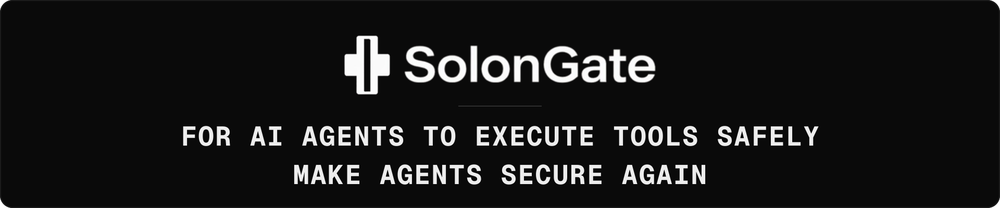
</div>

<p align="center">
  <a href="https://github.com/codeyevsky/solongate-oss/actions/workflows/ci.yml"></a>
  <a href="https://github.com/codeyevsky/solongate-oss/releases"></a>
  <a href="LICENSE"></a>
  <a href="https://go.dev"></a>
  <a href="https://nodejs.org"></a>
</p>

<p align="center">
  <a href="CONTRIBUTING.md"><b>Contributing</b></a> ·
  <a href="SECURITY.md"><b>Security</b></a>
</p>

---

SolonGate sits in front of every tool call an AI coding agent makes, every shell
command, every file read and every write, and decides whether it runs against
rules you wrote.

Everything stays on the machine. The policy is a file, the audit trail is a
file, and the guard contains no code that can open a socket. No account, no
telemetry.

Agents: **Claude Code**, **Codex**, **OpenCode**, **Antigravity**.

<div align="center">
  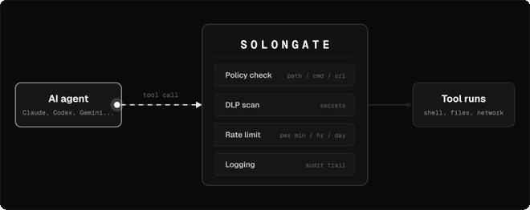
</div>

## Install

```bash
git clone https://github.com/codeyevsky/solongate-oss.git
cd solongate-oss
./install.sh
```

Then open a new terminal: hooks load when a session starts, so an already open
one is not guarded yet. `solongate update` pulls and reinstalls later.

The installer refuses to run from an agent, by design.

## What it looks like when it fires

A real Claude Code session: the agent reaches for a `.env`, the guard refuses it,
and the agent says so rather than quietly working around it.

<div align="center">
  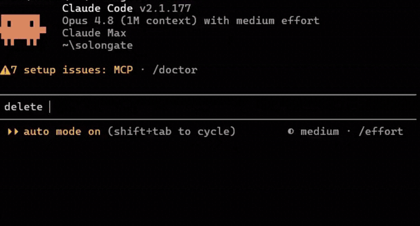
</div>

## What it enforces

| Layer | What it does |
| --- | --- |
| **Policy rules** | Allow or deny by path, command, filename or URL, scoped to READ, WRITE, EXECUTE or NETWORK. |
| **DLP** | 70 built in secret patterns plus your own, in four modes: observe, detect, redact, block. |
| **Egress** | Refuses an upload whose file holds a secret, which pattern matching alone cannot see. |
| **Rate limits** | A cap per minute, hour or day. |
| **The prompt** | A shim masks the outbound request body on Claude Code, which no tool call hook can reach. |
| **Tamper protection** | The guard's own state is unreachable from a tool call, and a policy in a repository cannot switch it off. |

Every decision lands in `~/.solongate/local-logs/solongate-audit.jsonl`, owner
only, one JSON object per line.

## The CLI

```
solongate              the dataroom: policies, audit, settings
solongate policy       list, create and edit the policy
solongate dlp          secret detection
solongate ratelimit    the rate limit
solongate audit        browse the audit trail
solongate watch        live tail tool calls
solongate trace        what the guard saw in this directory
solongate doctor       health check
solongate repair       restore the guard, hooks and settings
solongate update       pull the newest version and reinstall
```

Each one reads or changes a security posture, so they require a real terminal
and the guard refuses a tool call that invokes them. `solongate --help` is the
full tree.

## Supported agents

<table cellspacing="0" cellpadding="0" border="0" align="center">
  <tr>
    <td><a href="https://claude.com/claude-code">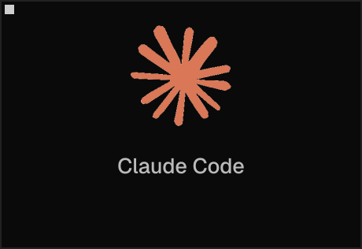</a></td>
    <td><a href="https://openai.com/codex">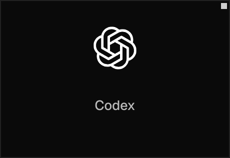</a></td>
    <td><a href="https://antigravity.google">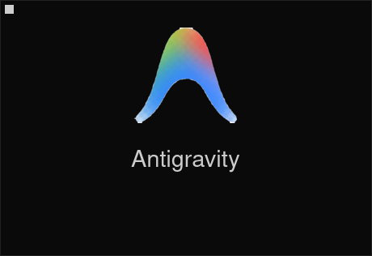</a></td>
    <td><a href="https://opencode.ai">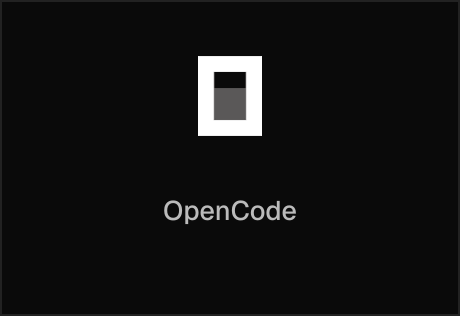</a></td>
  </tr>
  <tr>
    <td><a href="https://openclaw.ai">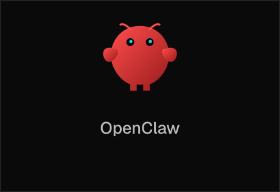</a></td>
    <td><a href="https://hermes.nousresearch.com">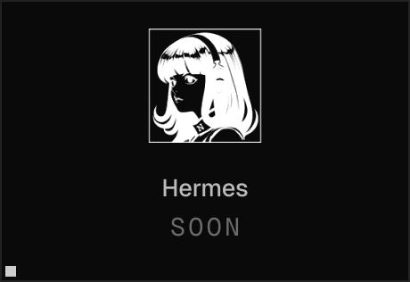</a></td>
    <td><a href="https://chainabit.com">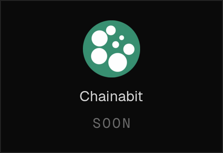</a></td>
    <td><a href="https://github.com/codeyevsky/solongate-oss/issues">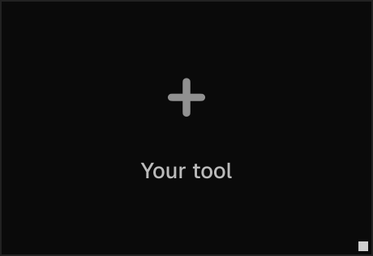</a></td>
  </tr>
</table>

## Contributing

Go 1.25 and Node 20+.

```bash
pnpm install
./test.sh
```

There are two implementations of the guard, in Go and in bundled JavaScript, and
which one decides a call depends only on whether a machine has the binary. They
have to agree, so the conformance suite runs against both and a change to the
decision path lands in both. [CONTRIBUTING.md](CONTRIBUTING.md) is the rest.

Reporting a vulnerability: [SECURITY.md](SECURITY.md), privately, never a public
issue. [CODE_OF_CONDUCT.md](CODE_OF_CONDUCT.md) applies everywhere.

## Licence

Apache License 2.0. See [LICENSE](LICENSE).
