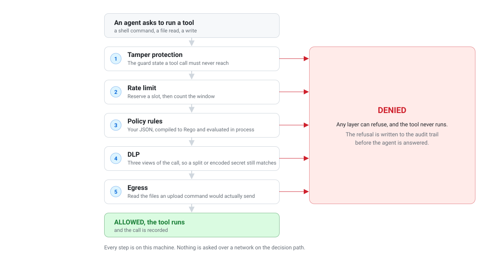
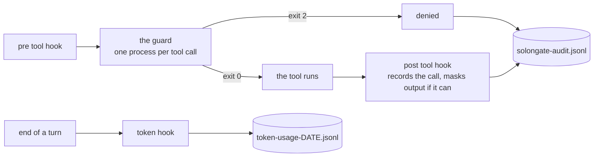
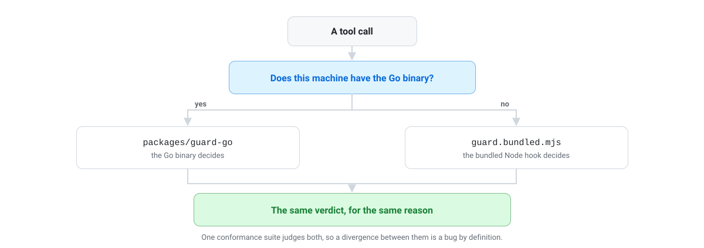

# Architecture

What runs when, which process decides, and where everything is on disk.

[ENGINEERING.md](../ENGINEERING.md) is the companion to this page: it carries the
reasoning and the failure modes. This one is the map.

## The decision path

<p align="center">
  <picture>
    <source media="(prefers-color-scheme: dark)" srcset="assets/decision-path-dark.svg">
    
  </picture>
</p>

Nothing in that path opens a socket. The policy is a file, it is compiled in the
guard, and the decision is local.

And the same thing as processes, including what happens after a call is allowed:



**Exit 2 is the only block.** Every client reads anything else, including the
crash codes, as allowed. A guard that dies on a malformed policy is a guard that
is not there, and from the outside it looks like a quiet machine.

## The processes

| | |
| --- | --- |
| **The guard** | One short lived process per tool call, spawned by the client's pre tool hook. Decides, records a denial, exits with a code the client understands. |
| **The audit hook** | One process per completed call, on clients with a post tool stage. Writes the allow row, and masks tool output where the client supports it. |
| **The token hook** | One process per turn, on clients that report usage. Writes the token usage line. |
| **The prompt shim** | A local proxy, for Claude Code only, that masks the outbound request body. A shell function redefines `claude` to route through it. |
| **The CLI and dataroom** | What you run. Human only, by terminal check, and refused by the guard when a tool call tries to invoke it. |
| **The MCP proxy** | A long lived process wrapping an MCP server, using the same evaluator. |

## Two implementations

There are two guards, and they are meant to be indistinguishable:

| | |
| --- | --- |
| `packages/guard-go` | The Go binary. What ships, and what decides on a machine that has it. |
| `packages/proxy/hooks` | The bundled JavaScript hook. Decides on a machine without the binary. |

**Which one decides a call depends only on whether the machine has the binary.**
Nothing else chooses, so certifying one certifies half the machines, and the
conformance suite runs against both.

<p align="center">
  <picture>
    <source media="(prefers-color-scheme: dark)" srcset="assets/two-implementations-dark.svg">
    
  </picture>
</p>

The installed hook prefers the binary and falls back to deciding itself when the
binary is missing, reports an older hook version, crashes, or hangs. A
conformance case (`go-delegation`) pins all four.

The hook version is the contract number: `hookVersion` in
`packages/guard-go/main.go`, `HOOK_VERSION` in the Node hook, and a test that
reads one and asserts the other equals it. A binary reporting an older number is
not used, because a machine running two different implementations where install
order decides which answers is worse than running the slower one.

## The packages

| Package | What it is | Depends on |
| --- | --- | --- |
| `packages/guard-go` | The guard: client adapters, tamper protection, rate limit, DLP application, the record | `sgpolicy`, `sgshared` |
| `packages/sgpolicy` | The policy engine: rule parsing, the Rego generator, the extractors, the fallback evaluator | `sgshared`, OPA |
| `packages/sgshared` | The shapes more than one program must agree about, and the secret scanner | **nothing external** |
| `packages/proxy` | The CLI, the TUI, the hooks, and the conformance suite, in TypeScript | npm deps |
| `packages/proxy-go` | The same CLI in Go, which ships as the binary | `sgpolicy`, `sgshared` |

`sgshared` has no external dependencies on purpose. The scanner in it runs before
every tool call, and it should not drag a policy engine in behind it.

`sgshared` exists at all because the same declarations were written twice and the
second copy drifted immediately. The drift was not a field: it was a hash
function, hashing bytes in one module and UTF-16 code units in the other. That
hash names a directory, computed independently in four places that never compare
it, so two implementations quietly used different folders for anyone whose home
directory was not in English. Nothing errored. The dataroom just showed an empty
ring.

So the rule for that package is narrow and worth keeping: it holds only what more
than one program must agree about.

## The two neutral shapes

Every layer between the two ends reasons over shapes that belong to SolonGate
rather than to any one client:

```
CALL     { client, tool, args, command, cwd, sessionId, response, raw }
DECISION { type: deny | allow | rewrite, reason, patch }
```

One adapter per client translates both ways. **No layer outside the adapter block
may branch on the client**, because clients name the same capability differently
(`Bash`, `run_command`, `shell`), and the neutral `permission` class is what
layers branch on instead.

Adding a client is adding one table entry. See [clients.md](clients.md).

## What the policy is evaluated against

The guard turns a call into one document:

```
{ tool_name, permission, trust_level, arguments, paths[], commands[], urls[], filenames[] }
```

The care went into the extractors, because this is where a rule either covers a
call or misses it:

- A script an exec tool would **run** is inlined into the command, so
  `bash deploy.sh` is judged by what `deploy.sh` contains.
- Globs are resolved to the files they name, so `cut staging.e*` is caught by the
  rule about `staging.env`.
- Relative paths are absolutized against the working directory.
- A content returning search gets its root as a path, because it reads every file
  under that root and names none of them.
- For a **non exec** tool, only explicit target fields count as an access, so
  writing a document that mentions `.env` is not reading one.

[policy.md](policy.md) has the field list and the matching semantics.

## Evaluation

The policy JSON is compiled to Rego inside the guard and evaluated with OPA in
process. That is the reason the decision never needs a network, and the reason
the project is in Go: OPA is written in Go, so the reference implementation
embeds directly, with no WASM stage and byte identical Rego semantics.

Two safety properties:

- **A policy that will not compile does not disarm the guard.** Evaluation falls
  back to a deterministic evaluator rather than allowing.
- **A badly typed rule does not take the policy down.** Rules are decoded one at
  a time and salvaged field by field. Decoding the array in one pass meant one
  quoted priority anywhere was read as no policy at all, which means allow
  everything.

The hook and the MCP proxy share one evaluator module rather than carrying an
evaluator each.

## Tamper protection

Runs **before** policy evaluation, and cannot be disabled by editing policies.
Even with every policy rule removed, these stay enforced. The only switch is
`selfProtect: false` in the machine's own policy file, and it fails safe: it
stays on when the setting cannot be read.

What is protected, because each one is a way to turn the guard off:

```
~/.claude/settings.json, settings.local.json
~/.codex/hooks.json, config.toml
~/.gemini/config/hooks.json
~/.solongate/hooks, policy.json, and the guard's own state
```

`~/.codex/config.toml` is in there because it holds the hook trust state Codex
manages: flipping it turns the guard off for Codex as surely as deleting the hook
entry.

Three shapes of check run, and all three are kept even where they overlap: an
absolute prefix, a glob, and a regular expression that ignores where in the tree
the file sits. A path form the check misses is a disarm vector, so nothing here
is tightened up in translation.

The CLI is protected the same way: the guard refuses a tool call whose command
invokes it. That is a fact about the caller rather than a guess about the
environment, and it holds whether or not the agent allocated a pseudo terminal.

## Environment variables

Only these are meant for you. Everything else prefixed `SOLONGATE_` is internal
plumbing between the processes above, and none of it is an enforcement exemption.

| | |
| --- | --- |
| `SOLONGATE_NO_GO_GUARD=1` | Pin the guard to its Node implementation. Same policy, slower. `doctor` reports when this is on. |
| `SOLONGATE_NO_GO_CLI=1` | Pin the CLI to its Node implementation. |
| `SOLONGATE_DEBUG=1` | Verbose hook logging. Off by default so a global hook does not litter every working directory. |
| `GO_BIN` | Which Go toolchain the installer and the build scripts use. |
| `SG_HOOK` | Which guard the conformance suite judges. Must be an absolute path. |
| `CODEX_HOME`, `XDG_CONFIG_HOME` | Honoured the way the clients honour them, so a machine that moved its config directory is registered where something reads it. |

`SOLONGATE_INTERNAL=1` used to exempt a caller from the human only gate, for a
daemon that no longer exists. It is not an exemption any more: all it did was
give an agent that exported it a clear path to editing the policy.

## On disk

```
~/.solongate/                       0700, owner only
├── policy.json                     the policy. the whole file: rules, security, selfProtect
├── bin/                            installed binaries, where the hook looks
├── hooks/                          installed hook programs
├── local-logs/
│   ├── solongate-audit.jsonl       one JSON object per decision, 0600
│   └── token-usage-<date>.jsonl    one line per turn
├── projects/<key>/                 per directory flags the hooks pass each other
├── .ratelimit-<agent>.log          fixed width append only call stamps
└── .hook-update-check              a timestamp, so the guard skips its update check
```

`<key>` is a hash of the absolute working directory, so per project state stays
separated without anything being written into your repository.

`.hook-update-check` is deliberately **not** protected: clearing it is how an
operator forces the guard to pick up a newer bundle on the next call.

A project may also carry `./policy.json`, read when the machine has no file of
its own, and carrying **rules only**. It lives in a repository the agent can
write to, so `selfProtect` and `security` are stripped from it.

## The contract

`packages/proxy/test` is the conformance suite: 26 files that run the guard as a
subprocess, feed it a client payload, and assert on the exit code, the files
touched and what a stub server does **not** receive. Nothing in it imports any
implementation's internals, which is what lets the same suite judge both.

A reimplementation is correct exactly when it passes this unchanged. Every case
in it exists because the behaviour it pins was once wrong, and the comments say
which. Among the divergences it has caught between the two implementations:

- the tamper patterns disagreeing about `*`
- the DLP list running 14 patterns against 70
- an ALLOW beating a DENY in the Rego chain
- a `curl -d @creds.env` upload that one blocked and the other allowed

[CONTRIBUTING.md](../CONTRIBUTING.md) is how to run it.

## What was removed, and why that matters here

Earlier versions had a cloud half: a service, a policy cache in front of the file
with a TTL and a background refresh, and a POST per audit entry.

It is gone rather than disabled, and while it remained the cache was worse than
dead: a service answering with an **empty** security block outranked the file by
design, so a machine whose own file configured DLP had it switched off by a reply
that said nothing about it.

What that leaves is the property this project is now built on: the file is not a
fallback, it is the policy.
