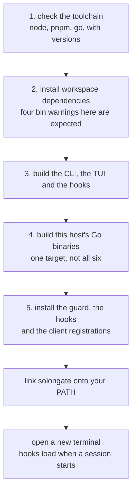

# Install

Two paths. The published package is the short one. This checkout is the one that
runs what is in the tree.

Either way, **open a new terminal afterwards.** Hooks load when a client session
starts, so a session that was already running is still operating under whatever
was registered when it launched, which may be nothing.

## Requirements

| | |
| --- | --- |
| Node | 20 or newer. The hooks are `.mjs` programs and run under node. |
| Go | 1.25 or newer, for building from this checkout. Not needed for the published package. |
| pnpm | 9 or newer, for building from this checkout. `corepack enable pnpm` is enough. |
| Platforms | Linux, macOS and Windows, on x64 and arm64. |

Node 19 or older fails later, as a syntax error inside a bundled hook, which
reads as the product being broken rather than the runtime being old. The
installer checks the version up front for that reason.

## From the published package

```bash
npm i -g @solongate/proxy
solongate
```

That opens the dataroom. Install the guard from the Settings panel, then open a
new terminal.

## From this checkout

```bash
git clone https://github.com/codeyevsky/solongate-oss.git
cd solongate-oss
./install.sh
```

`./install.sh --yes` runs it straight through without pausing between steps.

It stops between steps on purpose. Five steps produce several hundred lines, two
of them from a package manager and a bundler reporting at their own volume, and
the few lines the script prints itself are the ones worth reading. Each step ends
with one sentence saying what it did, and that sentence is the last thing on
screen while you decide whether to continue.

### What the five steps do



1. **Checks the toolchain.** Node, pnpm and Go, with versions. Go is found the
   way the build script finds it, which is not only `PATH`: a toolchain fetched
   by `go` itself for a newer `go.mod` lives in the module cache with no symlink
   anywhere. `GO_BIN` overrides the search.
2. **Installs workspace dependencies.** `pnpm install`. It warns four times that
   it could not create a bin (`solongate`, `solongate-proxy`, `proxy`,
   `solongate-audit`): it is linking commands at files the next step has not
   produced yet. Nothing is wrong and nothing needs rerunning.
3. **Builds the CLI, the TUI and the hooks.** The TypeScript half, bundled the
   way it ships.
4. **Builds this host's Go binaries.** One target, not all six. Six is what a
   release needs and takes minutes.
5. **Installs the guard, the hooks and the client registrations.** The freshly
   built binary is run **by path** to do this, which is the one thing this script
   exists to stop you doing by hand: the `solongate` on `PATH`, if there is one,
   is whatever was installed before, so asking it to install would install the old
   version over the new one.

Then it points a symlink on your `PATH` at the installed binary, trying
`~/.local/bin`, `~/bin` and `/usr/local/bin` in that order, and only a directory
that is both on `PATH` and writable. A real file already called `solongate` is
renamed to `solongate.before-solongate-install` rather than deleted. If no
candidate directory works, it tells you to add `~/.solongate/bin` to `PATH`
yourself.

### Why a plain `git pull` is not enough later

```bash
solongate update
```

It pulls the newest source into the checkout it was installed from, rebuilds and
reinstalls. The install writes that path down, so there is no directory to
remember. A `git pull` alone leaves the built artifacts and the installed guard
at the previous version.

## It will not run from an agent

Every command in the CLI changes a security posture, so the CLI requires a
terminal on both stdin and stdout, and the guard refuses a tool call that invokes
it.

Run `./install.sh` yourself. From an agent, the build steps succeed and the
install step is refused, with the reason printed rather than left to look like a
bug.

There is no environment variable that exempts anything from this.

## The same thing by hand

```bash
pnpm install
cd packages/proxy
pnpm build                                  # the CLI, the TUI and the hooks
pnpm build:go linux-x64                     # or your own: darwin-arm64, win32-x64, ...
./platforms/linux-x64/solongate repair      # install, using the build you just made
```

`pnpm build:go` with no target builds all six platforms, which takes a few
minutes and is what a release needs. One target is enough to try it.

The last command is run by path on purpose, for the reason in step 5 above. After
that one run, plain `solongate` is this build: an install puts the binaries in
`~/.solongate/bin`, which is where both the guard hook and the launcher on `PATH`
look for them.

## What is on disk afterwards

Everything SolonGate owns lives in one directory, owner only (`0700`, with files
at `0600`):

```
~/.solongate/
├── policy.json            your policy, if you have written one
├── bin/                   the installed binaries, where the hook looks for them
├── hooks/                 the installed hook programs
├── local-logs/            the audit trail and the token usage files
├── projects/<key>/        per directory flags the hooks pass to each other
└── .hook-update-check     a timestamp, so the guard skips its update check
```

`projects/<key>` is a hash of the working directory, so per project state stays
separated without anything being written into your repository.

And one registration per client, in the client's own configuration:

| Client | File |
| --- | --- |
| Claude Code | `~/.claude/settings.json` |
| Codex | `~/.codex/hooks.json`, honouring `CODEX_HOME` |
| OpenCode | `~/.config/opencode/plugins/solongate.js`, honouring `XDG_CONFIG_HOME` |
| Antigravity | `~/.gemini/config/hooks.json` |

Each of those is edited rather than replaced, and a backup is written beside it
(`settings.solongate.bak`, `hooks.solongate.bak`) before the first change.
[clients.md](clients.md) has the detail, including what each client can and
cannot do.

## Checking it

```bash
solongate doctor
```

It reports the policy file, the guard binary and its version, the hook
registrations per client, and the local log folder. `--json` is the same answer
machine readable.

Then prove enforcement rather than assuming it, which takes one minute:
[quickstart.md](quickstart.md).

## Uninstalling

There is no uninstall command. Removal is four steps, in this order:

1. Remove the SolonGate entries from each client file listed above. The backups
   beside them are from before the first change.
2. Delete `~/.solongate`.
3. Delete the `solongate` symlink from whichever directory the installer used,
   and restore `solongate.before-solongate-install` if it is there.
4. `npm rm -g @solongate/proxy`, if you installed from npm.

Then open a new terminal, for the same reason as installing: a running session
still carries the registration it started with.
