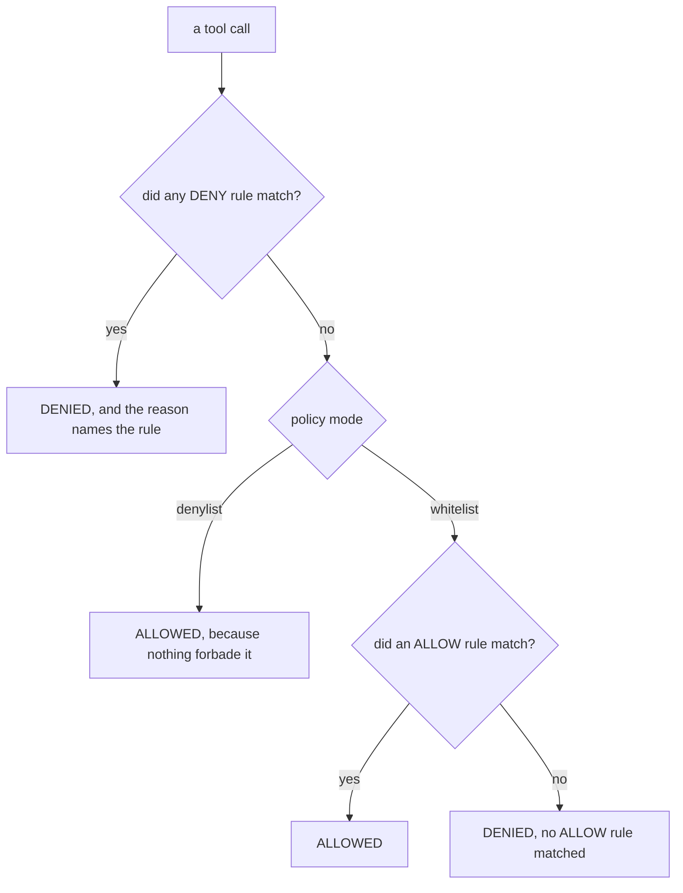

# Policy reference

A policy is JSON on disk. The guard reads it on every tool call, compiles it, and
evaluates the call against it. Nothing is fetched, cached or asked over a
network.

## Where the file is

Two locations, and only two.

| Path | What it may contain | When it is read |
| --- | --- | --- |
| `~/.solongate/policy.json` | Everything: rules, the `security` layers, the `selfProtect` flag | Always, when it exists |
| `./policy.json`, beside the agent's working directory | **Rules only** | When the machine has no file of its own |

The project file carries rules and nothing else because it lives inside a
repository the agent can write to. `selfProtect` and `security` are stripped from
it: either would be a way for the agent to switch a protection off from inside
the checkout.

### Two spellings

Both files are accepted in two shapes:

```json
{ "mode": "denylist", "rules": [] }
```

```json
{
  "policy":      { "mode": "denylist", "rules": [] },
  "security":    { },
  "selfProtect": true
}
```

The **presence** of a `policy` key is what tells them apart, even when its value
is `null`. A file carrying layers and no rules is a real configuration.

## Modes

```json
{ "mode": "denylist" }
```

| Mode | Default | Meaning |
| --- | --- | --- |
| `denylist` | allow | A call runs unless a DENY rule matched it. |
| `whitelist` | deny | A call is refused unless an ALLOW rule matched it. |

**A DENY always beats an ALLOW**, whatever the priorities say. Priority orders
rules of the same effect, it does not let an ALLOW outrank a DENY.



The DENY pass runs first and it runs in both modes. That ordering is the thing
to hold on to: sorting the whole chain by priority alone once let an ALLOW
written above a DENY win, which made **reordering rules change what was
enforced** with no number anywhere to explain why.

`whitelist` is the stronger posture and the more work: expect to add rules for a
while, because everything the agent legitimately needs has to be named. Start on
`denylist`, watch `solongate audit` for what your agent actually does, then
switch with `solongate policy mode <id> whitelist`.

```bash
solongate policy mode local whitelist
```

## A rule

```json
{
  "id": "no-force-push",
  "description": "Rewriting shared history is not an agent's decision",
  "effect": "DENY",
  "priority": 10,
  "enabled": true,
  "toolPattern": "*",
  "permission": ["EXECUTE"],
  "commandConstraints": { "denied": ["*push --force*", "*push -f*"] }
}
```

### Fields

| Field | Type | Notes |
| --- | --- | --- |
| `id` | string | Names the rule in the denial reason, in `solongate policy show`, and in `solongate policy rule <id> <ruleId> enable\|disable`. |
| `description` | string | Printed with the denial. Write it for the person who will read it at the moment they are blocked. |
| `effect` | `ALLOW`, `DENY`, `REVIEW` | See below for `REVIEW`. |
| `priority` | number | Lower runs earlier. Orders rules of the same effect. A missing priority is read as 100 by the fallback evaluator, so an unprioritised rule sorts with ordinary ones rather than ahead of every explicit priority. |
| `enabled` | boolean | **Always write it explicitly.** See the warning below. |
| `toolPattern` | glob | Matched against the tool name. `*` is every tool. |
| `permission` | string or array | One or more of `READ`, `WRITE`, `EXECUTE`, `NETWORK`. Scopes the rule to a class of call. |
| `minimumTrustLevel` | string | Accepted and **not evaluated**. See below. |
| `argumentConstraints` | object | Constraints on named arguments. |
| `pathConstraints` | object | `{ "allowed": [], "denied": [], "rootDirectory": "" }` |
| `commandConstraints` | object | `{ "allowed": [], "denied": [] }` |
| `filenameConstraints` | object | `{ "allowed": [], "denied": [] }` |
| `urlConstraints` | object | `{ "allowed": [], "denied": [] }` |

### Write `"enabled": true`

A rule with no `enabled` field is treated as **disabled** by the compiled
evaluator and as **enabled** by the fallback evaluator. That difference is
inherited from two code paths written years apart, and it is preserved rather
than reconciled, because picking either answer would change which rules fire on
somebody's live policy.

The consequence for you is simple: write the field. `solongate policy allow` and
`solongate policy deny` write it for you.

### `REVIEW`

`REVIEW` is an escalation to a human judge, and there is nothing in this
repository to escalate to. So:

- Under `denylist`, an unresolved `REVIEW` is an allow.
- Under `whitelist`, it is not an ALLOW match, so the default deny stands.

Treat it as unimplemented rather than as a third effect.

### `minimumTrustLevel`

Accepted for compatibility and never evaluated. The trust level in the policy
input is fixed to `TRUSTED`, because there has never been a real trust signal
behind it, and inventing one would silently change which rules fire. A rule that
relies on it is a rule that does nothing.

## Permission classes

`permission` is matched against a class derived from the **tool name**:

| Class | Tool names that produce it |
| --- | --- |
| `EXECUTE` | contains `exec`, `shell`, `run` or `eval`, or is exactly `bash` |
| `WRITE` | `apply_patch`, or contains `write`, `create`, `delete`, `update`, `set`, `edit`, `remove`, `insert`, `replace`, `patch`, `modify`, `append`, `overwrite`, `rename`, `move`, `mkdir`, `touch` |
| `NETWORK` | contains `fetch`, `http`, `request`, `curl`, `network`, `download` or `upload`, or is `websearch` |
| `READ` | everything else |

Two of those look like special cases and are not. Codex sends every file edit as
one tool called `apply_patch`, which no substring would catch, and Antigravity's
edit tool is `replace_file_content`, which is why `replace`, `patch` and `modify`
are in the WRITE list. `bash` is an exact match so that a tool merely named
`bashful-search` is not treated as a shell.

The list errs wide on purpose. A tool that classifies wrong is silently
unguarded rather than loudly broken, and the dangerous direction is a WRITE that
reads as a READ: `deny writes under config/` would leave the agent free to
rewrite `config/` all day.

## What the policy actually sees

The guard builds one document per call and evaluates the rules against it:

```
{ tool_name, permission, trust_level, arguments, paths[], commands[], urls[], filenames[] }
```

How `paths`, `commands`, `urls` and `filenames` get filled depends on whether the
tool **executes** what it is handed.

### For an exec tool

The whole command is an access target, and four things happen before matching:

- **A script the call would run is part of the call.** `bash deploy.sh` executes
  whatever `deploy.sh` contains, so its lines are appended to the command and the
  same matchers see them. The dangerous part being one file away does not hide
  it.
- **Globs are resolved to the files they name.** `cut staging.e*` is matched by
  the rule written about `staging.env`.
- **Relative paths are absolutized.** `cat forbidden/notes.txt` is caught by the
  rule that refuses `/abs/forbidden/notes.txt`.
- **A content returning search gets its root as a path.** A search tool reads
  every file under its root and names none of them, so the root stands in for
  what it will reach. Without this, a path rule holds against the read tool and
  is walked past by the search tool beside it.

### For everything else

Only the explicit target fields count as an access:

```
file_path, path, target_file, notebook_path, filename, dest, destination,
source, src, from, to, directory, dir, folder, url, urls, uri, href, link,
endpoint, absolutePath, targetFile, filePath
```

Everything else in the arguments, including a question, a description or a file
body, is data. Writing a document that mentions `.env` is not reading one, and
matching body text against filename rules is how that became a block.

## Matching

### Commands, filenames and URLs

Globs, case insensitive, matched against the whole value:

| Pattern | Matches |
| --- | --- |
| `*` | everything |
| `curl*` | a command starting with `curl` |
| `*push --force*` | `--force` anywhere after `push` |
| `https://*.github.com/*` | any github.com subdomain path |
| `git push * --force*` | works: more than one wildcard is a pattern, not a literal asterisk |

That last row is there because it once did not work. Anything other than one or
two stars in particular positions fell through to a literal comparison **with the
asterisk still in it**, so `https://*.github.com/*` allowed nothing and
`git push * --force*` blocked nothing. Both read correctly in `policy show`, which
is the whole problem: a rule that enforces nothing is indistinguishable from one
that enforces something until the day it was supposed to stop a call and did not.

### Paths

Path patterns have **segment semantics**. The pattern names directories, and the
wildcards say where that directory may sit, not which characters may surround it:

| Pattern | Means |
| --- | --- |
| `*secrets*` | a directory called `secrets` anywhere, and everything under it |
| `secrets*` | only a top level `secrets`, and everything under it |
| `*secrets` | a directory called `secrets` anywhere, the directory itself |
| `secrets` | only a top level `secrets`, the directory itself |

`my-secrets-notes.txt` and `mysecret/` match **none** of those, which is the
point. A substring matcher blocks files whose names merely mention the word, and
misses the directory the rule was written for when the path arrives relative.
Both were live behaviours before this.

A `*` **inside** the pattern keeps its ordinary meaning, bounded by the
separator:

| Pattern | Means |
| --- | --- |
| `**/*.env` | every `.env` file at any depth |
| `*.env` | a file named exactly `.env` |
| `config/?.json` | one non separator character |

`rootDirectory` is a literal prefix rather than a pattern, fed to a
starts with check, so only its separators are normalised.

Everything is case insensitive, and backslashes are normalised to forward
slashes, so one rule covers Windows and POSIX spellings.

### Whitespace

`solongate policy allow` and `solongate policy deny` trim the pattern before
storing it, and refuse one that is nothing but spaces.

**A hand edited file is taken literally.** `"curl * "` with a trailing space
never matches a command that does not end in one, and it prints as `curl *`
everywhere you would go to check it. If a rule looks right and enforces nothing,
look for the space first.

## Constraint shapes

### `allowed` and `denied` are asymmetric, and that is deliberate

The same two lists mean different things depending on the rule's effect. Read
this section once; it is where hand written policies go wrong.

```json
"commandConstraints": {
  "denied":  ["*rm -rf*"],
  "allowed": ["git *", "npm test*"]
}
```

**On a DENY rule**, the rule matches when the constraints are **violated**, which
is what makes it a denial:

- `denied`: matches when **some** command in the call matches one of the
  patterns. One bad command in a batch is enough.
- `allowed` on a DENY rule contributes nothing. Do not write it.

**On an ALLOW rule**, the rule matches only when **every** value satisfies the
constraints, so one bad path cannot ride along with the good ones:

- `denied`: every command must match none of the patterns.
- `allowed`: the call must carry at least one command, and every one of them must
  match a pattern.

That "at least one" guard is load bearing rather than defensive. In Rego, a check
over an empty collection is vacuously true, so without it an ALLOW rule scoped to
paths would match any call that touches no paths at all, which under `whitelist`
mode is a blanket allow for exactly the calls nobody wrote a rule for.

A rule with no constraints and only a `toolPattern` applies to every call that
tool makes.

### Paths

```json
"pathConstraints": {
  "rootDirectory": "/home/me/work",
  "allowed": ["src*", "docs*"],
  "denied":  ["*secrets*", "**/*.env"]
}
```

`allowed` and `denied` are segment patterns, with the same asymmetry as above.

`rootDirectory` follows it too, and the DENY direction surprises people:

- On an **ALLOW** rule: every path in the call must start with that prefix.
- On a **DENY** rule: the rule matches when **some path is not** under that
  prefix. `rootDirectory` on a DENY rule is how you write "refuse anything
  outside my working tree", not "refuse things inside it".

### Arguments

For a tool whose risk is in a parameter rather than in a path or a command:

```json
"argumentConstraints": {
  "recursive": true,
  "mode": "force",
  "timeout": { "$gt": 300 },
  "target":  { "$startsWith": "prod" },
  "branch":  { "$in": ["main", "release"] }
}
```

A bare value is an equality check. The string `"*"` asserts only that the
argument is present. An object takes these operators:

| Operator | Meaning |
| --- | --- |
| `$contains`, `$notContains` | substring |
| `$startsWith`, `$endsWith` | prefix, suffix |
| `$in`, `$notIn` | membership in a set |
| `$gt`, `$lt`, `$gte`, `$lte` | numeric comparison |

Argument keys are matched exactly, so they are per client: the same capability
may arrive as `command` on one client and `cmd` on another. Check
`solongate trace` for the names a call actually carries before writing one of
these.

### A badly typed rule does not disarm the policy

Rules are decoded one at a time, and a rule that will not decode is salvaged
field by field, keeping only what is well typed.

That exists because decoding the array in one pass meant a single wrongly typed
field anywhere, a `denied` written as a bare string, a quoted priority,
`"enabled": 1`, failed the whole decode, and a policy that would not decode was
read as **no policy**, meaning allow everything. A hand edited file could disarm
the guard completely while every view still listed its rules as active. That is
the one failure direction this project is not allowed to have.

## The engine

The policy JSON is compiled to Rego **inside the guard** and evaluated with OPA
in process, which is the reason the decision never needs a network. The Rust
reimplementations of Rego are "mostly compliant", and every rule would need
re-verifying against one, so the reference implementation is embedded instead.

If a policy will not compile, evaluation falls back to a deterministic evaluator
rather than allowing. **A policy we cannot compile must never quietly disarm the
guard**: slow but guarded, never fast but unguarded. Evaluation has a five second
ceiling, and the same rule applies if it is hit.

The MCP proxy uses the same evaluator, so a policy means one thing in both
places. See [mcp-proxy.md](mcp-proxy.md).

## Editing without the JSON

```bash
solongate policy list
solongate policy create <name>
solongate policy show <id>
solongate policy mode <id> denylist|whitelist

solongate policy allow <id> --command '<glob>'
solongate policy allow <id> --path '<pattern>'
solongate policy allow <id> --filename '<glob>'
solongate policy allow <id> --url '<glob>'
solongate policy deny  <id> ...                 # the same four flags
solongate policy allow <id> --path 'config*' --permission WRITE

solongate policy rule <id> <ruleId> enable|disable
solongate policy revoke <id> <ruleId>
solongate policy activate <id>
solongate policy activate --off
solongate policy active
```

`local` works as `<id>` for the machine's own policy.

`--permission` only belongs on a rule about files or commands, and the CLI
refuses a typo rather than storing a rule that reads correctly and matches
nothing.

`solongate audit whitelist <logId>` turns a line of the audit trail into an ALLOW
rule, and `solongate audit block <logId>` into a DENY. Both default to
`--scope exact` rather than `--scope tool`, because a whitelist that widened to
the whole tool by default would be a very quiet way to disarm a policy.

## Worth knowing

- **`solongate policy show <id>` prints what each rule matches**, not just its
  patterns. Read it after writing a rule by hand.
- **A disabled first rule used to break the compiled chain.** It does not any
  more, and there is a conformance case pinning it, but it is the kind of thing
  worth knowing exists if you are reading generated Rego.
- **Two rules in a fourteen rule policy enforcing nothing is a thing that
  happened**, through the wildcard bug above. `solongate policy show` is how you
  check, and the conformance suite now sweeps the whole matrix rather than
  sampling it.
- **The audit trail is the feedback loop.** Run on `denylist` with
  `solongate watch` open for a day before you write the policy you think you
  want.
