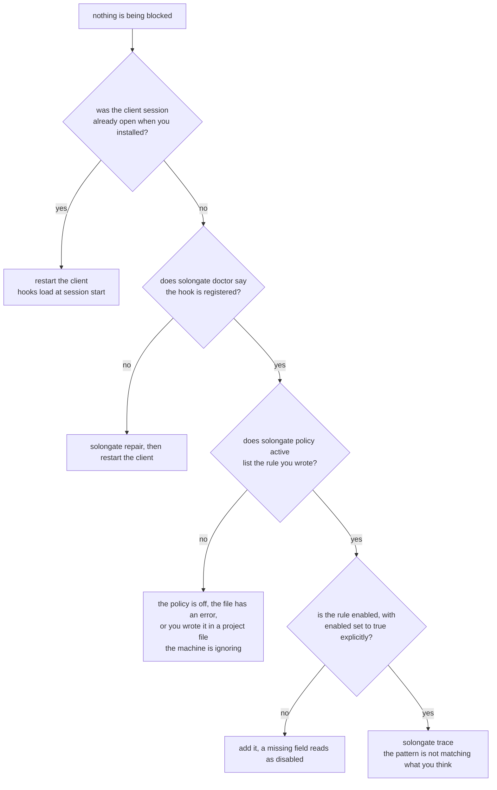

# Troubleshooting

Start with this, always:

```bash
solongate doctor
```

It reports the policy file, the guard binary and its version, the hook
registration per client, and the log folder, each with a verdict. Most problems
are one of the four things it checks.

## Nothing is being blocked

In the order it is usually the answer.



### 1. The session was already open

**Hooks load when a client session starts.** A terminal or an editor that was
running before you installed or updated is still operating under whatever was
registered when it launched, which may be nothing.

Quit the client and start it again. Not a new tab in the same process: a new
session.

This is the answer more often than everything else on this page combined.

### 2. A hook is not registered

```bash
solongate doctor
solongate repair
```

`repair` is idempotent. It reinstalls the binaries, rewrites every client
registration and restores the settings files.

Then start a new session, for the reason above.

### 3. The policy is not what you think it is

```bash
solongate policy active
```

That prints the **resolved** policy, which is what actually decides calls. Three
things it will reveal:

- The policy is deactivated. `solongate policy activate <id>` pins one, and
  `--off` is a real setting that enforces nothing.
- The file has a syntax error, so fewer rules survived than you wrote. Rules are
  decoded one at a time and salvaged field by field, so a quoted priority or a
  `denied` written as a bare string loses that rule rather than the whole file.
- You wrote the policy into a project `./policy.json` while the machine has its
  own `~/.solongate/policy.json`. The project file is read **only** when the
  machine has no file of its own.

### 4. `"enabled"` is missing

A rule with no `enabled` field is treated as **disabled** by the compiled
evaluator. Write `"enabled": true` explicitly on every hand written rule.

### 5. The pattern reads correctly and matches nothing

```bash
solongate policy show <id>      # what each rule matches
solongate trace                 # what the guard saw in this directory
```

`trace` is the fast answer. It shows the call after path resolution and glob
expansion, which is what the rules were matched against.

The three usual causes:

- **A trailing space.** `"curl * "` never matches a command that does not end in
  one, and it prints as `curl *` everywhere you would go to check it. The CLI
  trims patterns it writes; a hand edited file is taken literally.
- **A path pattern used as a substring matcher.** Path patterns name
  **directories**: `*secrets*` is a directory called `secrets` anywhere, and
  `my-secrets-notes.txt` matches none of the four spellings. See
  [policy.md](policy.md).
- **The wrong permission class.** `permission` is derived from the **tool name**.
  A client whose edit tool is named something unexpected may classify as `READ`,
  so a WRITE scoped rule misses it. `solongate trace` prints the class.

### 6. The tool is not the tool you think

Clients name the same capability differently, and Codex sends every file edit as
one call named `apply_patch` with the paths inside the patch text. Write rules
against paths, commands and the permission class rather than against
`toolPattern`, unless you have checked the name in `trace`.

## Everything is being blocked

### The mode is `whitelist`

```bash
solongate policy active
solongate policy mode local denylist
```

`whitelist` refuses everything no ALLOW rule matches, which on a fresh policy is
everything. It is the right destination and a hard starting point.

### An ALLOW rule is narrower than it looks

On an ALLOW rule, **every** value in the call must satisfy the constraint, not
just one. A call that edits three files needs all three to match. That asymmetry
is deliberate: one bad path must not ride along with the good ones.

### A custom DLP pattern is too wide

```bash
solongate dlp show
solongate dlp mode detect
```

Custom DLP patterns are **globs**, so `*` matches any run of non whitespace
characters. A pattern like `*key*` matches most source code. Switch to `detect`,
read `solongate audit --signal dlp` for an hour, and narrow it.

### `block` mode is doing exactly what it says

In `block` mode, a read of **any** file holding a secret is refused outright: the
agent cannot work with that file at all. If you want the call to run with the
value hidden, that is `redact`:

```bash
solongate dlp mode redact
```

### The rate limit is below your normal volume

```bash
solongate ratelimit show
solongate stats
solongate ratelimit set --mode detect
```

An agent reading a handful of files and running a test suite easily makes dozens
of calls a minute. A cap in the low tens will interrupt ordinary work.

## Specific messages

### `SolonGate is human-only`

You ran a CLI command without a terminal on both stdin and stdout: from a script,
from CI, through a pipe, or as an agent tool call. That is the gate working.

Run it yourself in a terminal. There is no environment variable that exempts
anything.

Note that a terminal **inside** an editor is fine. Only the terminal check
applies, and an integrated terminal has one.

### Exit code 69

That command is not implemented in this binary yet. Deliberately neither 0 nor 1:
0 would tell a script the command succeeded, and 1 is indistinguishable from the
command running and failing.

### `Tamper protection: command references protected resource`

A tool call tried to touch a file that can turn the guard off: a client's
settings, the policy file, the installed hooks. This runs before policy
evaluation and cannot be switched off by a policy.

If it is **you** who needs to edit that file, do it yourself in a terminal rather
than through an agent. If an agent needs to read documentation that merely
mentions those paths, note that a mention is not an access: the check is about
paths a call would touch.

### `the build reported success but ... is not there`

`pnpm build:go <target>` failed in a way that did not surface. Run it directly in
`packages/proxy` and read the output.

### Four warnings during `pnpm install`

```
could not create bin: solongate, solongate-proxy, proxy, solongate-audit
```

Expected. It is linking commands at files the build has not produced yet, and the
next step produces them. Nothing needs rerunning.

### A pnpm upgrade notice in the middle of the install

Also expected, also not a problem. The installer suppresses it now, but an older
checkout will show it.

## Install and update

### `solongate` is not on `PATH`

The installer links into the first of `~/.local/bin`, `~/bin` and
`/usr/local/bin` that is both on `PATH` and writable. If none of them was, it
says so and tells you to add this yourself:

```bash
export PATH="$HOME/.solongate/bin:$PATH"
```

### `solongate --version` reports an old number

The npm launcher resolves a platform package shipped beside it before it looks in
the store, so an old global install can keep running a binary from a different
build while the guard enforcing your calls is the new one. Two versions, one
name.

`./install.sh` repoints the link at the binary it just installed, every time. Run
it from the checkout.

### `solongate update` refuses

It will not run with uncommitted changes in the checkout the install was made
from, rather than overwriting them. Commit or stash them, or run `./install.sh`
from a clean checkout.

### No Go toolchain, on a machine that has one

A toolchain fetched by `go` itself for a newer `go.mod` lives in the module cache
with no symlink anywhere, so a plain `PATH` search misses it. The installer
handles that case; if it still fails, set `GO_BIN` to the binary.

## Reading what happened

```bash
solongate trace                      # this directory, allows included
solongate audit --filter DENY        # every refusal
solongate audit --signal dlp         # what the scanner found
solongate audit --signal ratelimit   # what hit the cap
solongate watch                      # live, as calls are decided
solongate stats drift --days 7       # denials rising or falling
```

The denial is written **before** the agent is answered, so it is on disk even if
the client crashed immediately afterwards.

## Still stuck

[SUPPORT.md](../SUPPORT.md) says where to ask and what to include. The short
version: the output of `solongate doctor`, which client, the policy in force, and
the exact call.

If a call that should have been refused **ran**, that is not a support question.
Report it privately: [SECURITY.md](../SECURITY.md).
